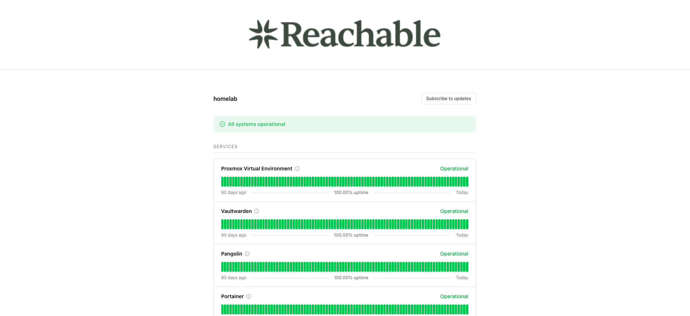
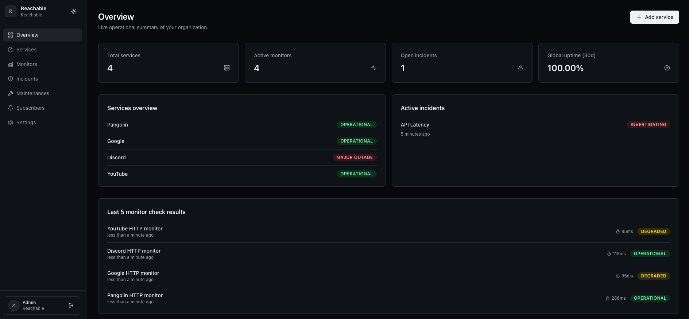
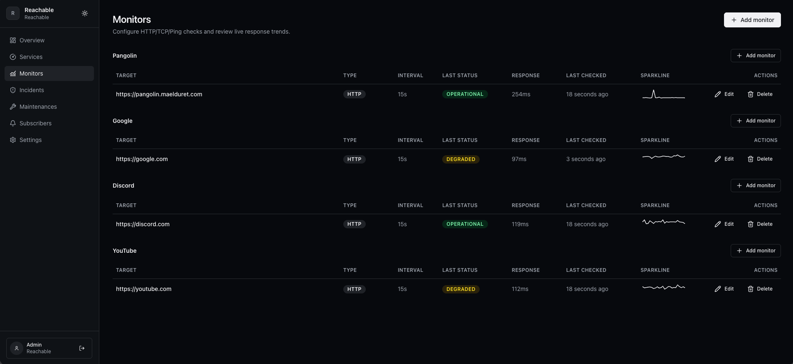
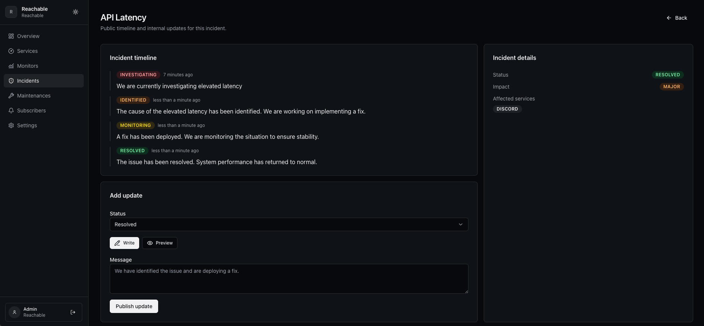

<div align="center">


<svg></svg>

Open-source status pages and uptime monitoring built for the AI era.  
Free. Blazing-fast. Self-hostable.

[Quick Start](#quick-start) • [Screenshots](#screenshots) • [Configuration](#configuration)

</div>

---



## Built For Fast Incident Communication

Reachable gives you a polished public status page and an operations dashboard in one stack, with realtime updates and clean workflows for incidents, maintenance, and subscribers.

### Highlights

- Public status page on `/`
- Dashboard on `/dashboard`
- Realtime updates via WebSocket
- Incident + maintenance workflows
- SMTP notifications

## Quick Start

```bash
git clone https://github.com/ryzenixx/reachable.git
cd reachable
docker compose up -d
```

### First Run

1. Reachable is available directly on `http://SERVER_IP:3000`
2. If you use an external reverse proxy, target `HTTP -> SERVER_IP:3000`
3. Open `/setup`, create organization + owner account
4. In `Dashboard -> Settings -> General`, set your public domain
5. Continue to `/dashboard`

## Configuration

No environment variables are required for standard deployment.

Reachable auto-generates internal secrets (including PostgreSQL password) on first boot and stores them in the persistent storage volume.

Optional advanced overrides can still be provided through `.env` or your deployment panel (for example `POSTGRES_PASSWORD`, `FRONTEND_URL`).

## Update

```bash
docker compose pull
docker compose up -d
```

## Screenshots

| Dashboard Overview | Dashboard Monitors |
| --- | --- |
|  |  |

| Dashboard Incidents | Public Status Page |
| --- | --- |
|  |  |

## Development

```bash
docker compose -f docker-compose.dev.yml up -d --build
```

## License

AGPL-3.0. See `LICENSE`.
