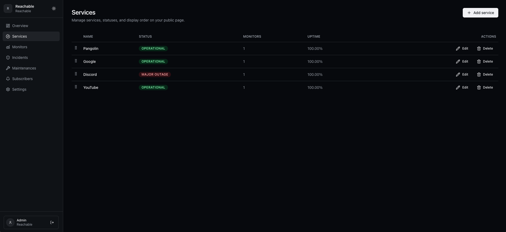

<div align="center">

# Reachable

### Know before your users do.

Open-source status pages and uptime monitoring. Free and self-hostable.

<p>
  
  
  
  
  
</p>

<p>
  <a href="#quick-start">Quick Start</a> ·
  <a href="#screenshots">Screenshots</a> ·
  <a href="#configuration">Configuration</a> ·
  <a href="#development">Development</a>
</p>

</div>

---

## What Reachable Gives You

- Public status page at `/`
- Operational dashboard at `/dashboard`
- Realtime status updates (Reverb WebSockets)
- Incidents, maintenances, subscribers, and notifications
- SMTP-based email flow (confirmation + incident updates)
- One-command Docker deployment

## Product Scope

Reachable is designed as **single-organization per instance**.

That keeps onboarding simple, infrastructure predictable, and self-hosting friction low.

## Architecture

`docker-compose.yml` runs exactly 3 services:

- `reachable` → all-in-one container (frontend + API + Horizon + Reverb + scheduler)
- `postgres` → PostgreSQL 16
- `redis` → Redis 7

## Quick Start

```bash
git clone https://github.com/ryzenixx/reachable.git reachable
cd reachable
```

Run Reachable:

```bash
docker compose pull
docker compose up -d
```

Optional overrides:

```bash
cp .env.example .env
# edit only what you need
```

Local endpoints:

- App: `http://localhost:3000`
- Dashboard: `http://localhost:3000/dashboard`
- API: `http://localhost:8009/api/v1`
- WebSocket: `ws://localhost:8080`

First-time setup:

1. Open `http://localhost:3000/setup`
2. Create organization + owner account
3. Continue in `/dashboard`

## Screenshots

| Public Status Page | Dashboard Overview |
| --- | --- |
|  |  |

| Dashboard Services | Dashboard Incidents |
| --- | --- |
|  |  |

## Configuration

Reachable starts with sane defaults. `.env` is optional.

### Common Overrides

- `API_PORT`, `FRONTEND_PORT`, `REVERB_PORT`
- `REACHABLE_IMAGE`
- `POSTGRES_DB`, `POSTGRES_USER`, `POSTGRES_PASSWORD`

### Reverse Proxy / Custom Domain

For clean links in outgoing emails:

- set `FRONTEND_URL` globally
- or set **Public URL for email links** in Dashboard Settings (per organization override)

## Development

Use local source builds with the dev compose file:

```bash
docker compose -f docker-compose.dev.yml up -d --build
```

## Security Baseline

- Keep `APP_DEBUG=false` in production
- Use strong credentials/secrets for DB, Redis, SMTP
- Terminate TLS at your reverse proxy
